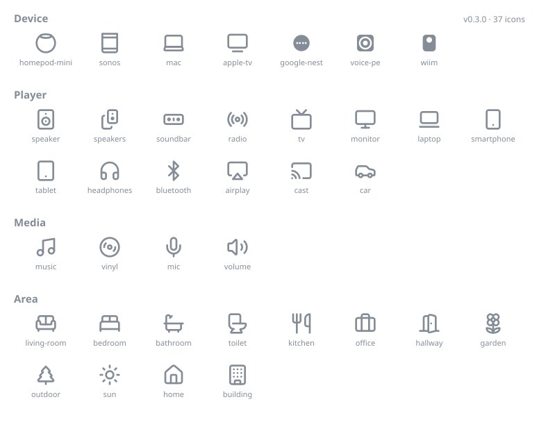

# Music Assistant shared icons

The canonical icon set for Music Assistant players, devices and areas. One set of
identifiers served by the server, one set of SVG artwork rendered by every client
(web frontend, mobile app, and anything else that comes along).

## Why this exists

Player icons used to be free-form [Material Design Icons](https://pictogrammers.com/library/mdi/)
names (`mdi-speaker`), which tied every client to the MDI set and made the web
frontend's icon choices leak into other clients. This repo replaces that with:

- **A small, curated set of set-agnostic icon ids.** The server stores and serves
  `"speaker"` or `"kitchen"`, it knows nothing about icon libraries.
- **One SVG per id**, so all clients render the exact same artwork. The web frontend
  consumes them directly; mobile converts them to vector assets at build time.
- **A machine-readable [`manifest.json`](manifest.json)** describing every icon:
  its category, search keywords, aliases and closest MDI equivalent.

## The set

Browse the searchable gallery at **https://music-assistant.github.io/shared-icons/** —
regenerated from the manifest on every push. Individual SVGs can be hotlinked via
jsDelivr, e.g. `https://cdn.jsdelivr.net/gh/music-assistant/shared-icons@main/icons/speaker.svg`.

<!-- GENERATED:START — do not edit by hand; run `node scripts/generate-docs.mjs` -->



| Id             | Name          | Category | Aliases                             | MDI fallback                |
| -------------- | ------------- | -------- | ----------------------------------- | --------------------------- |
| `homepod-mini` | HomePod mini  | device   | `homepod`, `apple-homepod-mini`     | `mdi-speaker`               |
| `sonos`        | Sonos         | device   | —                                   | `mdi-speaker`               |
| `mac`          | Mac           | device   | —                                   | `mdi-laptop`                |
| `apple-tv`     | Apple TV      | device   | `appletv`                           | `mdi-apple`                 |
| `speaker`      | Speaker       | player   | —                                   | `mdi-speaker`               |
| `speakers`     | Speaker group | player   | `speaker-multiple`, `speaker-group` | `mdi-speaker-multiple`      |
| `radio`        | Radio         | player   | —                                   | `mdi-radio`                 |
| `tv`           | TV            | player   | `television`                        | `mdi-television`            |
| `monitor`      | Monitor       | player   | —                                   | `mdi-monitor`               |
| `laptop`       | Laptop        | player   | `laptop-2`, `laptop-minimal`        | `mdi-laptop`                |
| `headphones`   | Headphones    | player   | —                                   | `mdi-headphones`            |
| `bluetooth`    | Bluetooth     | player   | `bluetooth-speaker`                 | `mdi-bluetooth`             |
| `airplay`      | AirPlay       | player   | —                                   | `mdi-cast-variant`          |
| `cast`         | Cast          | player   | —                                   | `mdi-cast`                  |
| `car`          | Car           | player   | —                                   | `mdi-car`                   |
| `music`        | Music         | media    | `music-2`                           | `mdi-music`                 |
| `vinyl`        | Vinyl         | media    | `disc-3`                            | `mdi-album`                 |
| `mic`          | Microphone    | media    | `microphone`                        | `mdi-microphone`            |
| `volume`       | Volume        | media    | `volume-2`, `speaker-loud`          | `mdi-volume-high`           |
| `living-room`  | Living room   | area     | `sofa`                              | `mdi-sofa`                  |
| `bedroom`      | Bedroom       | area     | `bed-double`, `bed`                 | `mdi-bed`                   |
| `bathroom`     | Bathroom      | area     | `bath`                              | `mdi-bathtub`               |
| `kitchen`      | Kitchen       | area     | `utensils`                          | `mdi-silverware-fork-knife` |
| `office`       | Office        | area     | `briefcase`                         | `mdi-briefcase`             |
| `hallway`      | Hallway       | area     | `door-open`                         | `mdi-door-open`             |
| `garden`       | Garden        | area     | `flower-2`, `flower`                | `mdi-flower`                |
| `outdoor`      | Outdoor       | area     | `tree`, `tree-pine`                 | `mdi-pine-tree`             |
| `sun`          | Sun           | area     | —                                   | `mdi-weather-sunny`         |
| `home`         | Home          | area     | `house`                             | `mdi-home`                  |
| `building`     | Building      | area     | —                                   | `mdi-office-building`       |

<!-- GENERATED:END -->

## The contract

These rules are what make it safe for clients to bundle the icons:

1. **Ids are stable forever.** An id is never renamed and never removed. Renames
   happen by adding the new id and keeping the old one as an alias.
2. **The set only grows — slowly.** Additions require a real, recurring need
   (not one person's device) and design review. Clients ship the whole set, so
   restraint is a feature.
3. **Unknown id → render `speaker`.** The manifest's `fallback` field is the single
   fallback for every client. A client on an older icon set must degrade gracefully
   when the server serves an id it doesn't know yet.
4. **Aliases resolve, they don't render.** Clients must resolve an alias to its
   canonical id before lookup. Aliases exist for legacy values and upstream renames;
   they are globally unique and never collide with ids.
5. **`mdi` is a downgrade mapping, not an identity.** It names the closest MDI icon
   for contexts that can only display MDI (e.g. Home Assistant entities) and drives
   the one-time migration of legacy `mdi-*` values stored in player configs.

## Manifest format

```jsonc
{
  "id": "homepod-mini", // canonical, kebab-case, stable forever
  "name": "HomePod mini", // human label for pickers
  "category": "device", // device | player | media | area
  "source": { "set": "custom" }, // custom, or vendored: { set, name, version }
  "keywords": ["apple", "smart speaker"], // extra picker search terms
  "aliases": ["homepod"], // legacy/alternate ids resolving here
  "mdi": "mdi-speaker", // closest MDI equivalent
}
```

The full schema lives in [`schema/manifest.schema.json`](schema/manifest.schema.json)
and is enforced in CI together with the SVG rules below (`node scripts/validate.mjs`).

## Artwork rules

- `viewBox="0 0 24 24"` => everything is drawn on the shared 24×24 grid.
- Painted exclusively with `currentColor`; no hardcoded colors, so clients theme
  icons by setting the CSS/text color.
- Stroke icons follow the [Lucide](https://lucide.dev) style: `stroke-width="2"`,
  round caps and joins, `fill="none"`. Fill icons (detailed device silhouettes)
  are the exception, not the rule.
- No scripts, embedded images or external references. Max 6 KB per file.
- Vendored icons are committed as generated — edit custom artwork only; re-vendor
  upstream icons instead of hand-editing them.

> **Note:** the four original custom icons (`apple-tv`, `mac`, `homepod-mini`,
> `sonos`) were authored on larger grids and are currently normalized with a scale
> transform, and `speakers` is a first draft. A design pass redrawing them natively
> on the 24×24 grid is welcome.

## Using the icons

**Web frontend** => depend on the npm package and import SVGs or read the manifest:

```ts
import manifest from "@music-assistant/shared-icons/manifest.json"
import speaker from "@music-assistant/shared-icons/icons/speaker.svg"
```

**Mobile (Kotlin Multiplatform)** => fetch a tagged release of this repo at build
time and convert `icons/*.svg` to vector assets. Ids map 1:1 to file names; apply
the alias and fallback rules from the manifest.

**Server** => serves icon ids only (player `icon` config entries). The manifest can
be used to validate values and to migrate stored legacy `mdi-*` names via the `mdi`
field.

## Adding an icon

1. Open an issue first, see rule 2 above. Agree on the id, category and source.
2. Prefer vendoring from [Lucide](https://lucide.dev) or [Tabler](https://tabler.io/icons);
   only draw custom artwork for things those sets don't have.
3. Add `icons/<id>.svg` following the artwork rules.
4. Add the manifest entry (id, name, category, source, keywords, aliases, mdi).
5. Run `node scripts/validate.mjs && node scripts/generate-docs.mjs` (the second
   command refreshes the README table, `docs/preview.svg` and the gallery — CI
   fails if they're stale) and open a PR.

## Versioning & releases

The set is versioned semantically in `manifest.json` and `package.json`:

- **patch** => artwork tweaks, keyword/alias additions, metadata fixes
- **minor** => new icons
- **major** => never, if we do our job right (the contract forbids breaking changes)

Each release is published as an npm package (web) and a git tag / release tarball
(mobile asset pipeline).

## License

Apache-2.0 for this repository and the custom icons. Vendored icons remain under
their upstream licenses — see [ATTRIBUTION.md](ATTRIBUTION.md).
